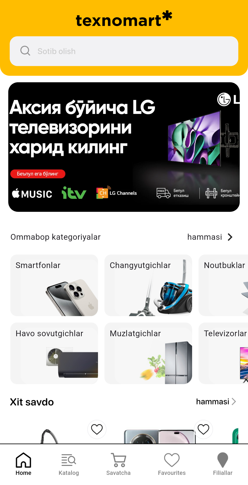
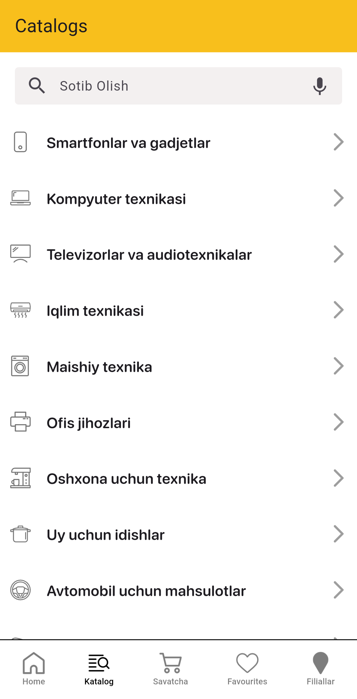
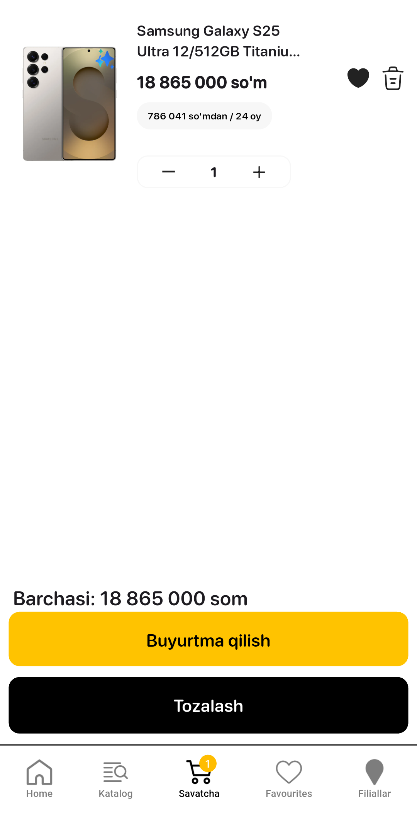
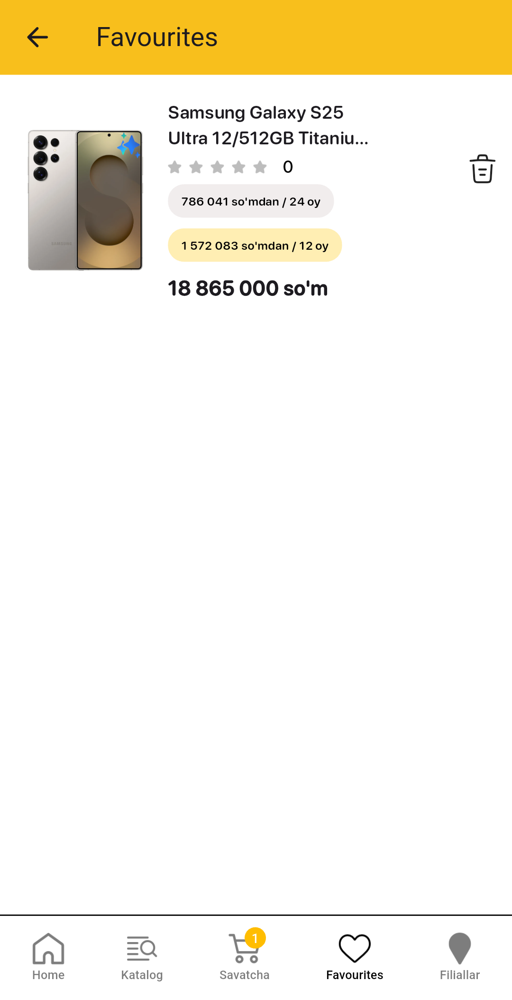
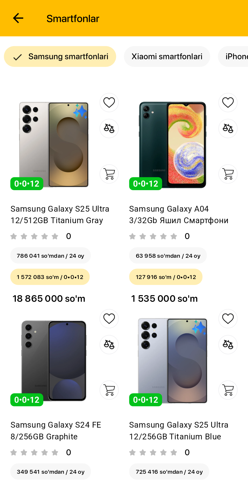
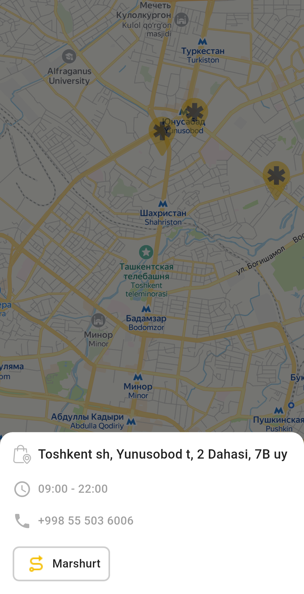

# Texnomart (Clone)

Texnomart is a Flutter-based mobile application that replicates the functionality of the Texnomart store, a well-known electronics retailer in Uzbekistan. This app allows users to browse products, place orders, and locate store branches on the map.

## 🛍 Features

- **Product Catalog** – Browse a wide range of electronics and appliances.
- **Order Placement** – Add products to the cart and place orders.
- **Store Locator** – Find the nearest Texnomart store on the map.
- **Smooth UI & Performance** – Optimized for a seamless user experience.

## 🛠 Technologies Used

- **Dio & Retrofit** – Efficient API communication.
- **Rest API** – Fetch and manage data.
- **YandexMapkit Lite** – Integrated map services.
- **Bloc & Provider** – State management.
- **Slider** – Interactive UI components.
- **Hive** – Local data storage.

## 📸 Screenshots

<table>
  <tr>
    <td></td>
    <td></td>
    <td></td>
  </tr>
<tr>
    <td></td>
    <td></td>
    <td></td>
  </tr>
</table>

## 🚀 Try the App

Download the APK and explore Texnomart on your mobile device.

---

**Author: Imotdinov Bunyodbek**  
**Contact: [imotdinovbunyodbek2@gmail.com](mailto:imotdinovbunyodbek2@gmail.com)**
